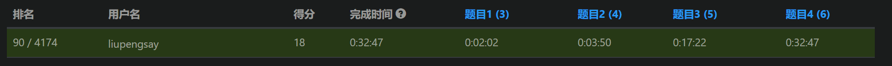

# 【儿须成名酒须醉】力扣[第85场双周赛]题解
***
### 写在前面
双周赛刷新最佳排名，写下粗浅又不够优雅的题解纪念进了前百，差分数组不太熟在题目三停顿了十几分钟，好像最近几场都是有两道题是同样的算法领域

[第85场双周赛]: https://leetcode.cn/contest/biweekly-contest-85/

***    
## [题目一: 得到 K 个黑块的最少涂色次数]
### 解题思路
枚举连续黑色方块的起点位置，计算白色方块的个数，遍历取最小值
- 暴力枚举
### 代码
```python3
class Solution:
    def minimumRecolors(self, blocks: str, k: int) -> int:
        ans = k
        n = len(blocks)
        for i in range(n-k+1):
            # 枚举
            cur = blocks[i:i+k].count('W')
            if cur < ans:
                ans = cur
        return ans
```

### 复杂度分析
设数组长度为$n$，连续个数为$k$，则有
- 时间复杂度$O(nk)$
- 空间复杂度$O(k)$
***
## [题目二：二进制字符串重新安排顺序需要的时间]
### 解题思路
数据规模有限，直接进行字符串替换模拟
- 暴力模拟
### 代码
```python3
class Solution:
    def secondsToRemoveOccurrences(self, s: str) -> int:
        ans = 0
        while '01' in s:
            # 模拟
            s = s.replace('01', '10')
            ans += 1
        return ans
```
### 复杂度分析
设字符串长度为$n$，则有
- 时间复杂度$O(n^2)$
- 空间复杂度$O(n)$
***
## [题目三：字母移位 II]
### 解题思路
使用差分数组计算每个位置总共左移或者右移的位数，与现有的加和后取模得到最终的字符
- 前缀和
- 差分数组
### 代码
```python3
class Solution:
    def shiftingLetters(self, s: str, shifts: List[List[int]]) -> str:
        # 计算差分数组
        n = len(s)
        diff = [0]*n
        for i, j, d in shifts:
            if d == 1:
                if j+1 < n:
                    diff[j+1] -= 1
                diff[i] += 1
            else:
                if j+1<n:
                    diff[j+1] += 1
                diff[i] -= 1
        # 计算每个位置的移动位数
        lst = [diff[0]]
        for d in diff[1:]:
            lst.append(lst[-1]+d)
        # 获取变换结果
        ans = []
        for w in s:
            ans.append(ord(w)-ord('a'))
        for i in range(n):
            ans[i] = (ans[i] + lst[i]) % 26
        word = "abcdefghijklmnopqrstuvwxyz"
        ans = [word[i] for i in ans]
        return "".join(ans)
```
### 复杂度分析
设字符串长度为$n$，变换数组长度为$m$，则有
- 时间复杂度$O(n+m)$
- 空间复杂度$O(n)$
***
## [题目四：删除操作后的最大子段和]

### 解题思路
使用两个有序集合分别维护剩余区间段，以及剩余区间段的和
- 前缀和
- 有序集合
### 代码
```python3
from sortedcontainers import SortedList


class Solution:
    def maximumSegmentSum(self, nums: List[int], removeQueries: List[int]) -> List[int]:
        # 记录前缀和
        pre = [0]
        for num in nums:
            pre.append(pre[-1]+num)
        n = len(nums)
        ans = []
        # 剩余区间段
        lst = SortedList([[0, n-1]])
        # 剩余区间段的和
        sub = SortedList([pre[-1]])
        for m in removeQueries:
            i = lst.bisect_left([m, m])
            # 找寻对应的区间段进行去除
            if i < len(lst) and lst[i][0]<=m<=lst[i][1]:
                x, y = lst[i]
                lst.pop(i)
            else:
                x, y = lst[i-1]
                lst.pop(i-1)
            # 去除对应的区间段和
            sub.discard(pre[y+1]-pre[x])
            # 更新断开消除后的剩余区间
            sub1 = [x, m-1]
            if m-1>=x:
                lst.add(sub1)
                sub.add(pre[m]-pre[x])
            sub2 = [m+1, y]
            if y>=m+1:
                lst.add(sub2)
                sub.add(pre[y+1]-pre[m+1])
            # 获得查询结果
            if sub:
                ans.append(sub[-1])
            else:
                ans.append(0)
        return ans
```
### 复杂度分析
设数组长度为$n$，查询长度为$m$，则有
- 时间复杂度$O(mlogn)$
- 空间复杂度$O(n)$
***
### 写在最后
谢谢阅读，大家一起继续努力

[题目一: 得到 K 个黑块的最少涂色次数]: https://leetcode.cn/contest/biweekly-contest-85/problems/minimum-recolors-to-get-k-consecutive-black-blocks/

[题目二：二进制字符串重新安排顺序需要的时间]: https://leetcode.cn/contest/biweekly-contest-85/problems/time-needed-to-rearrange-a-binary-string/
[题目三：字母移位 II]: https://leetcode.cn/contest/biweekly-contest-85/problems/shifting-letters-ii/
[题目四：删除操作后的最大子段和]: https://leetcode.cn/contest/biweekly-contest-85/problems/maximum-segment-sum-after-removals/
