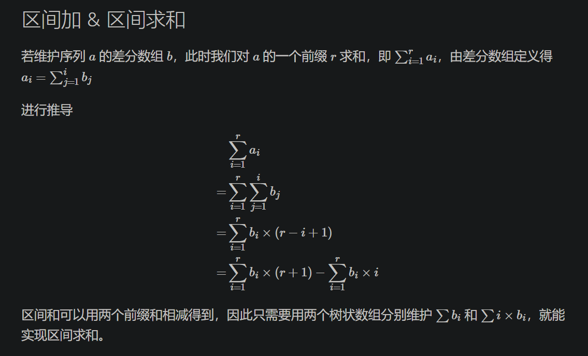

# [树状数组]

```Python3
# 单点更新与前缀求和
class TreeArray:
    # 数组索引从1开始
    def __init__(self, n):
        self.n = n
        self.c = [0]*(n+1)

    # 求x的二进制表示中，最低位的1的位置对应的数，向右相加更新管辖值，向左相减获得前缀和
    @staticmethod
    def lowest_bit(x):
        return x & -x

    # 给nums索引x增加k，同时维护对应受到影响的区间和c数组
    def add(self, x, k):
        while x <= self.n:  # 不能越界
            self.c[x] = self.c[x] + k
            x = x + self.lowest_bit(x)
        return

    # 前缀求和
    def get_sum(self, x):  # a[1]..a[x]的和
        ans = 0
        while x >= 1:
            ans += self.c[x]
            x -= self.lowest_bit(x)
        return ans
```


```Python3
# 使用差分数组进行区间更新与求和
class TreeArray:
    # 数组索引从1开始
    def __init__(self, n):
        self.n = n
        self.t1 = [0]*(n+1)
        self.t2 = [0] *(n+1)

    @staticmethod
    def lowest_bit(x):
        return x & (-x)

    # 更新单点的差分数值
    def add(self, k, v):
        v1 = k * v
        while k <= self.n:
            self.t1[k] = self.t1[k] + v
            self.t2[k] = self.t2[k] + v1
            k = k + self.lowest_bit(k)

    # 更新差分的区间数值
    def add1(self, l, r, v):
        self.add(l, v)
        self.add(r + 1, -v)

    # 求差分数组的前缀和
    def get_sum(self, t, k):
        ret = 0
        while k:
            ret = ret + t[k]
            k = k - self.lowest_bit(k)
        return ret

    def get_sum1(self, l, r):
        a = (r+1) * self.get_sum(self.t1, r) - self.get_sum(self.t2, r)
        b = l * self.get_sum(self.t1, l - 1) - self.get_sum(self.t2, l - 1)
        return a - b
```

[树状数组]: https://oi-wiki.org/ds/fenwick/