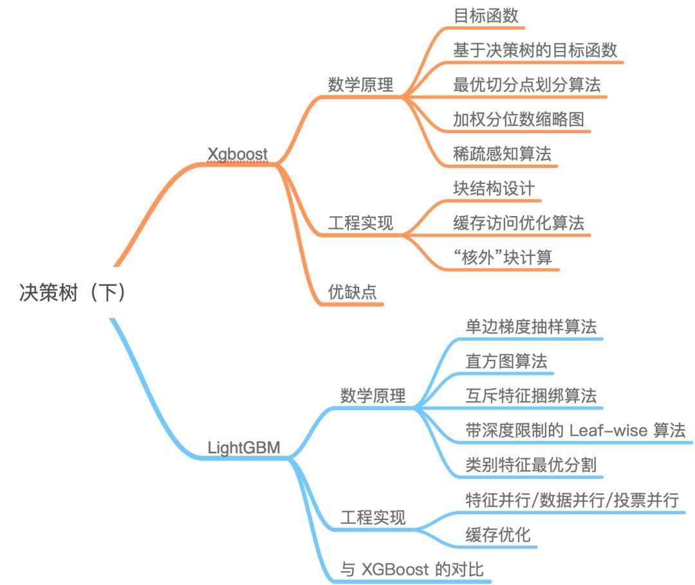

# LightGBM与XGBoost的区别

- 均为基于Boosting框架的主流集成算法，都是机器学习领域GBDT算法的工程化实现。

## 参考链接
1. [终于有人把XGBoost 和 LightGBM 讲明白了，项目中最主流的集成算法！](https://cloud.tencent.com/developer/article/1542638)
2. [GBDT、XGBoost、LightGBM的区别和联系](https://www.jianshu.com/p/765efe2b951a)
3. [LightGBM 中文文档](https://lightgbm.apachecn.org/#/)
4. [XGBoost, LightGBM性能大对比](https://zhuanlan.zhihu.com/p/24498293)
5. [gbdt/xgboost/lightGBM比较](https://marian5211.github.io/2018/03/12/%E3%80%90%E6%9C%BA%E5%99%A8%E5%AD%A6%E4%B9%A0%E3%80%91gbdt-xgboost-lightGBM%E6%AF%94%E8%BE%83/)
6. [XGBoost 中文文档](https://xgboost.apachecn.org/#/)
